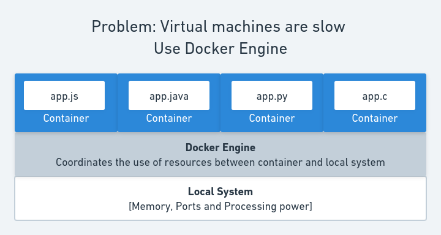

# Docker Introduction

## What happens when you run multiple applications on the same local host?

A single local machine can have multiple programms running simultaneously on it.
Each process or application will share the same underlying physical resources of
the local machine. These resources include, processing power, storage and
memory.


The above process works fine, until multiple processess start competiting for
the same resource. It can be when two different applications try to access the
same file or try to run on same port. This can lead to conflict and one of the
applications is bound to fail.


## What is a possible solution for this situation?

The intitutive solution would be to isolate these different application and run
them in an isolated environment. This environment is provided by a Virtual
Machine(VM). A virtual machine (VM) is a virtual environment that functions as a
virtual computer system with its own CPU, memory, network interface, and
storage, created on a physical hardware system

This VM will run on the local machine (or remote machine) and will consume the
physical resources (RAM,memory and processing power). Each VM is contains its
own operating system complete with applications required to run a particular
application. Most commonly used VM images are linux based. A VM will emulate the
functionality of a separate physical computer.

### Drawbacks of using Virtual Machines

**Performance**

Even though the machines are virtualized in a virtual machine, it still relies
on the resources from the host machine. A computer needs to be powerful enough
to run several virtual machines on a single host computer. If its power is not
sufficient enough, it will cause stability issues in the performance.

**Speed**

Since virtual machine access the physical machine indirectly, the time to boot
up and process operations are slower. It might take several minutes to boot up a
virtual machine, since effectively its is starting a new machine and has to
perform the OS boot operations. 


## Alternative rather a "Better Alternative" to VMs: Docker

Docker is an open platform for developing, shipping, and running applications.
Docker enables you to separate your applications from your infrastructure so you
can deliver software quickly.

Docker provides the ability to package and run an application in a loosely
isolated environment called a container. The isolation and security allows you
to run many containers simultaneously on a given host. Containers are
lightweight and contain everything needed to run the application, so you do not
need to rely on what is currently installed on the host.


### **Advantages of using Docker**

**Consistent Environment**

Consistency is a key benefit of Docker wherein developers run an application in
a consistent environment right from design and development to production and
maintenance. As such, the application behaves the same way in different
environments, eliminating production issues.

**Speed and Agility**

Speed and agility is another key benefit of Docker. It allows you to instantly
create containers for every process and deploy them in seconds. As you don’t
have to boot the OS, the process is done lightning fast. Moreover, you can
instantly create, destroy, stop or start a container with ease. By simply
creating a configuration file using YAML, you can automate deployment and scale
the infrastructure at ease.

[source](https://www.cloudtern.com/cloud/top-5-advantages-of-using-docker/).



### **Creating containers with Docker**

Docker creates a level of abstraction on top of the local machine and allows
launching application in self sufficient and self contained enviroments. Before
we can launch sucn an enviroment its important to understand how an application
get containerized.


Your entire application is bundled into an image. This image acts as a single
source of reference which can be used to create copies of application
(containers). Each container will have the same behavior since it is generated
using the same build image.


### **Creating a Docker image**

A Docker image can be build by using text configuration written in a
[Dockerfile](Dockerfile). Using the docker build command one can create a docker
image

```
docker build ./path-to-Dockerfile  image-name
```

This command generates an image as per specifications in the Dockerfile. A new
container can be started simply using the image-name given in the previous
command. Please know that this build is a one time step and a new image will
only be build when either the code changes or when some configuration changes in
the Dockerfile.

A new container can be created from an image using the docker run command.

```
docker run image-name
```

The run command can be executed with differnt options, some of them are
presented in the image below. Complete list can be found in the official
[Docker documentation](https://docs.docker.com/).


